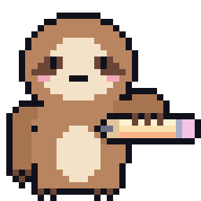
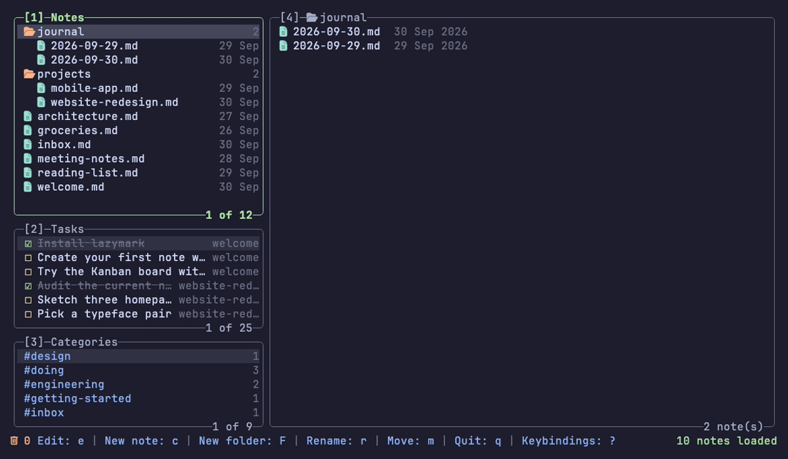
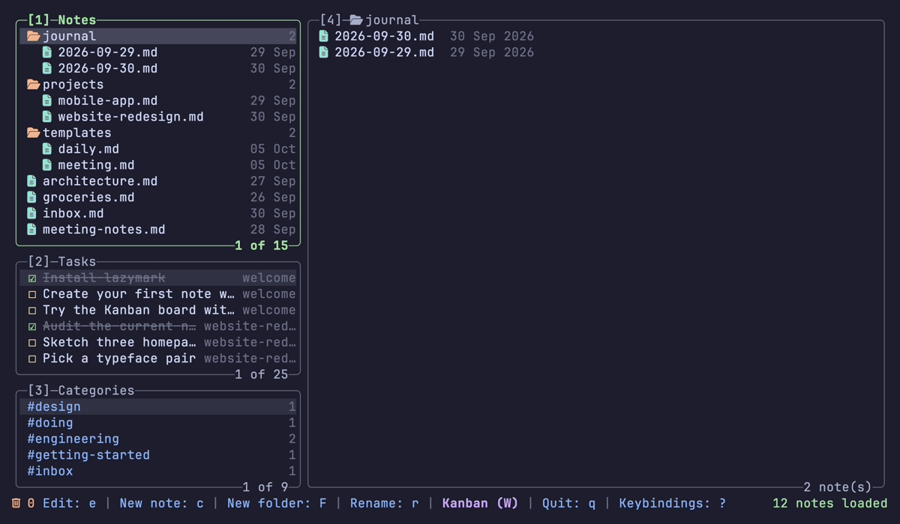
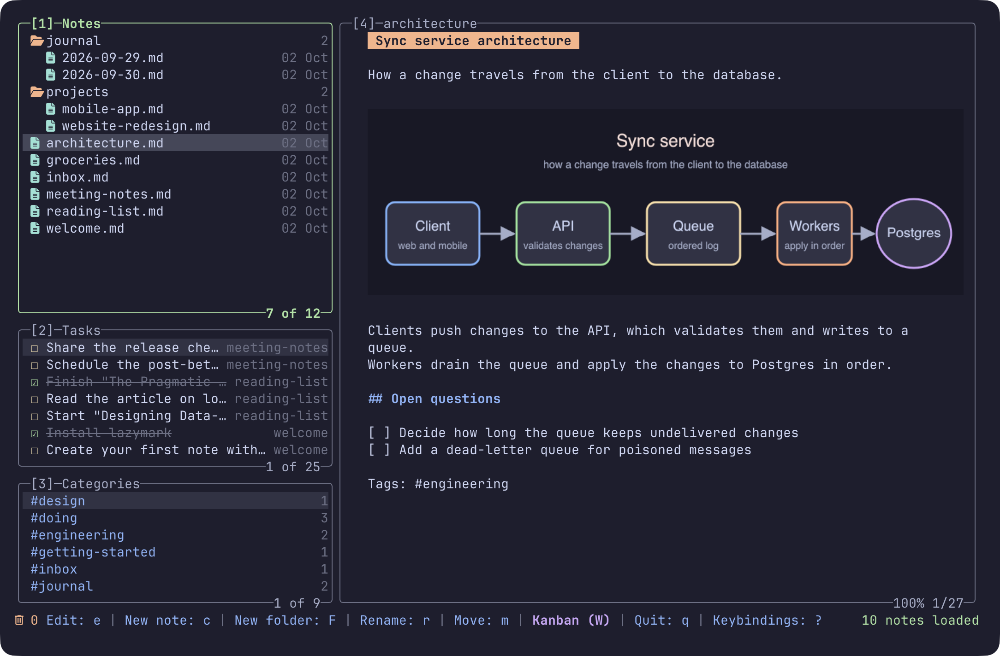

<div align="center">



# lazymark

**Markdown notes, tasks and a Kanban board in your terminal, in the style of lazygit.**

Plain markdown files. Keyboard and mouse. Inline images.

[](https://github.com/MathiasDrizzy/lazymark/actions/workflows/ci.yml)
[](go.mod)
[](LICENSE)



[Install](#install) · [Quick start](#quick-start) · [Keys](#keys) · [Configuration](#configuration)

</div>

## Why lazymark

- **Your notes stay yours.** They are plain markdown files in one folder. Edit them with any editor; lazymark only rewrites the line you change and never overwrites a note that changed outside it.
- **Learn it by looking at it.** Panels, rounded borders and a bar of keys at the bottom, like lazygit. Press `?` for the keys of the panel you are in.
- **Keyboard or mouse.** Every action has a key. You can also click rows and the keys in the bottom bar, drag the divider between the columns and use the scroll wheel.
- **Tasks come from your notes.** The Tasks panel lists the checkboxes you already wrote, and ticking one changes only that line.
- **Safe by default.** Deleted notes go to a trash for 20 days, and folders with content always ask first.

## What it does

### Notes and folders

One tree for folders and notes. Create, rename, move and delete with a single key; the cursor lands on what you just created.


### Tasks

Every `- [ ]` and `- [x]` in your notes, in one list. `Space` ticks a task and rewrites only its line; `H` hides the finished ones. The preview shows the note at the task's line.


### Categories

Every `#tag` in your notes. `Enter` on a tag shows only the notes that have it.


### Kanban board

The same tasks as three columns: To Do, In Progress and Done. Move a card with `H` and `L` or `Shift+←` and `Shift+→`, and the change is written back to the note. Nothing is hidden: `Kanban (W)` opens the board from the notes view, `Notes (W)` and `← Notes (Esc)` take you back, and the bottom bar always lists what the selected card can do.



### Inline images

Images in a note show up in the preview, in place, in terminals that support the Kitty graphics protocol. `Ctrl+V` pastes the image on your clipboard into the note, and pasting a copied image file imports it.



### Settings and themes

Press `,`. Fourteen themes (Catppuccin ×4, Tokyo Night, Gruvbox, Nord, Dracula, One Dark, Rosé Pine, Kanagawa, Everforest, Solarized Dark and Light), changed live, and the whole interface follows them, including the markdown preview. **Screen background** is `theme` by default and paints the whole screen with the theme's base color; `terminal` keeps your terminal's background, so a translucent terminal stays translucent. You can also pick the notes folder here.


### Paste images from your editor

Copy a screenshot, or an image file in the file manager, open the note in micro, vim or GNU nano and press one key: the `` reference lands at the cursor and the image is saved next to the note. `lazymark editor-plugins install` sets it up; the keys are `Alt-i` in micro, `\ip` in vim and `Alt-7` in nano (on macOS terminals, set Option to act as Alt). The GIF runs micro's `pasteimage` command, which `Alt-i` also runs. The nano that ships with macOS is Pico and has no key bindings: use GNU nano (`brew install nano`). See [docs/editor-plugins.md](docs/editor-plugins.md).


## Install

Install a [Nerd Font](https://www.nerdfonts.com/) in your terminal for the folder and note icons. Building needs Go 1.27.1 or newer.

**With Go**

```sh
go install github.com/MathiasDrizzy/lazymark/cmd/lazymark@latest
```

**From source**

```sh
git clone https://github.com/MathiasDrizzy/lazymark.git
cd lazymark
go build -o lazymark ./cmd/lazymark
```

**Homebrew (macOS)**

```sh
brew install mathiasdrizzy/tap/lazymark
```

**Prebuilt binaries** for macOS, Linux and Windows are on the [Releases page](https://github.com/MathiasDrizzy/lazymark/releases).

## Quick start

1. Run `lazymark`. It opens `~/Documents/notes`, creating it if needed. Use `lazymark --dir <folder>` for another folder, or pick one later in Settings.
2. Press `c`, type a name and press `Enter` to create a note. Press `e` to write in your editor (`$EDITOR`, `micro` if it is not set).
3. Press `?` any time to see the keys.

## Keys

The essentials. `?` shows the keys of the panel you are in, and [docs/keybindings.md](docs/keybindings.md) has all of them.

<!-- keys:start -->
| Keys | Action |
|---|---|
| `↑` `↓` | Up / Down |
| `Tab` | Next panel |
| `1` `2` `3` `4` | Jump to a panel |
| `c` `F` | New note / New folder |
| `r` `m` `d` | Rename / Move / Delete |
| `Space` | Toggle a task (Tasks panel) |
| `W` | Kanban board |
| `x` | Trash |
| `?` `,` | Keybindings / Settings |
| `q` | Quit |
<!-- keys:end -->

## Configuration

Most things are in Settings (`,`) and are saved at once. They live in a `config.json` in your user configuration folder (`~/Library/Application Support/lazymark/` on macOS, `~/.config/lazymark/` on Linux, `%AppData%\lazymark\` on Windows). A file with only what you want to change is enough:

```json
{
  "theme": "tokyo-night",
  "editor": "code --wait",
  "screen_background": "theme",
  "popup_background": "none"
}
```

See [docs/configuration.md](docs/configuration.md) for every setting, the command line and the commands for scripts and other tools (`lazymark task list`, `lazymark mcp`, and more). If you write in micro, vim or nano, [docs/editor-plugins.md](docs/editor-plugins.md) shows how to paste a copied image into the note from the editor.

## Compatibility

| | Status |
|---|---|
| macOS | Developed and tested here, including the interface. |
| Linux | Builds, and its tests run on every change. Not used interactively by the author yet. |
| Windows | Builds, and its tests run on every change. Not used interactively by the author yet. |

| Terminal | Inline images |
|---|---|
| Ghostty | ✓ tested |
| Kitty, WezTerm | ✓ support the protocol, not tested |
| Any other | ✗ each image shows as `[image: name.png]` |

Limitations:

- Tasks are the lines that start with `- [ ]` or `- [x]`; checkboxes inside an indented list are not listed yet.
- The Kanban board has three fixed columns.
- Pasting an image from the clipboard (`Ctrl+V`, or `lazymark paste` from an editor) needs `osascript` or `pngpaste` (macOS), `wl-paste` or `xclip` (Linux) or PowerShell (Windows).
- The editor plugins need micro, vim or GNU nano; nano also needs the note to be opened from lazymark.
- The terminal must be at least 60 columns by 20 rows.

## Contributing

Issues and pull requests are welcome. Run `go test ./...` before sending a change, and `git config core.hooksPath scripts/hooks` to run `gofmt`, `go vet` and the tests before every commit. CI runs on Linux, macOS and Windows.

The GIFs are made from the tapes in [assets/readme](assets/readme/CAPTURES.md), so they can be redone with `vhs`.

## License

[MIT](LICENSE)
