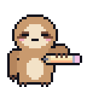
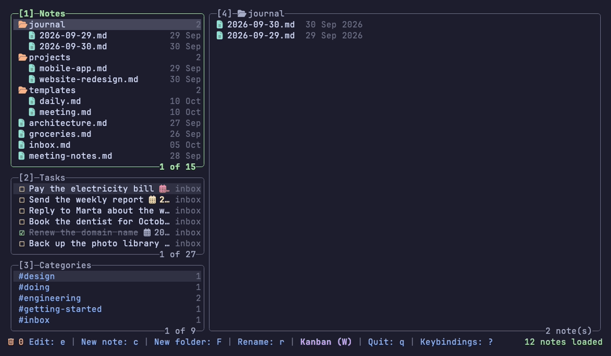
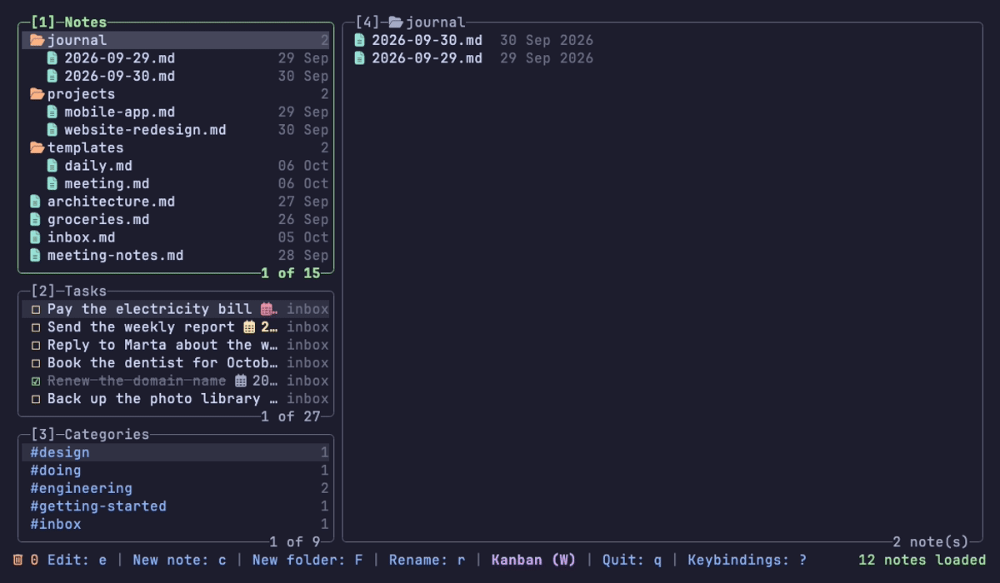
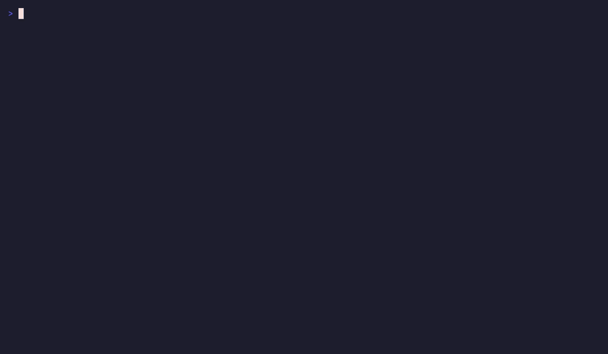
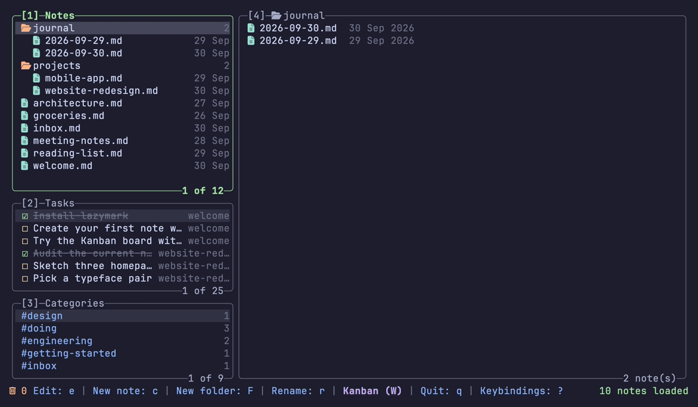

<div align="center">



# lazymark

**Lazy markdown notes, tasks and a Kanban board in your terminal.**

Plain markdown files. Keyboard and mouse. Inline images.

[](https://github.com/MathiasDrizzy/lazymark/actions/workflows/ci.yml)
[](go.mod)
[](LICENSE)


[Install](#install) · [Quick start](#quick-start) · [Keys](#keys) · [Configuration](#configuration)

</div>

## Why lazymark

- **Your notes stay yours.** They are plain markdown files in one folder. Edit them with any editor; lazymark only rewrites the line you change and never overwrites a note that changed outside it.
- **Learn it by looking at it.** Panels, rounded borders and a bar of keys at the bottom. Press `?` for the keys of the panel you are in.
- **Keyboard or mouse.** Every action has a key. You can also click rows and the keys in the bottom bar, drag the divider between the columns and use the scroll wheel.
- **Tasks come from your notes.** The Tasks panel lists the checkboxes you already wrote, and ticking one changes only that line.
- **Safe by default.** Deleted notes go to a trash for 20 days, and folders with content always ask first.

## What it does

### Notes and folders

One tree for folders and notes. Create, rename, move and delete with a single key; the cursor lands on what you just created.


### Templates and the daily note

Put notes in a `templates/` folder and start new ones from them with `C`; `{{date}}`, `{{time}}` and `{{title}}` are filled in. `T` opens today's note, `journal/YYYY-MM-DD.md`, made from `templates/daily.md` the first time; `lazymark daily` does the same from the shell. See [docs/templates.md](docs/templates.md).



### Tasks

Every `- [ ]` and `- [x]` in your notes, in one list. `Space` ticks a task and rewrites only its line; `H` hides the finished ones. The preview shows the note at the task's line.


### Dates

Select a task, in the Tasks panel or on the board, and press `d`. A small popup asks for **Start** and **Due**: type a date the way you say it (`2026-10-09`, `today`, `tomorrow`, `+3d`, `+1w` or a weekday such as `friday`, in your interface language) and the resolved date appears next to the field before you save. Leave a field empty to remove that date, `Esc` cancels. On the board, clicking the dates of a card opens the same popup. From the shell, `lazymark task due <id> 2026-10-09` and `lazymark task start <id> …` do the same.



The completion date is added by itself when you tick a task. On screen the dates are monochrome glyphs in the theme's colors (an overdue due date in the error color). In the file they are kept at the end of the task line in the [Obsidian Tasks](https://publish.obsidian.md/tasks/Introduction) format, so Obsidian and other tools read them too (the exact format is in [docs/cli.md](docs/cli.md)); you never have to type it.
### Categories

Every `#tag` in your notes. `Enter` on a tag shows only the notes that have it.


### Kanban board

Each task is a card with a rounded border: its text (up to 2 lines), its note and its dates (set them with `d`, see Dates). Settings has "Cards: rectangles | compact" for the one-row view.

The same tasks as columns: To Do, In Progress and Done by default. Move a card with `H` and `L` or `Shift+←` and `Shift+→`, or drag it with the mouse to another column: the card and the target column are highlighted while you drag, `Esc` cancels. Inside a column, `K` and `J` (or `Shift+↑` and `Shift+↓`) move a card up and down, and dragging it over another card of the same column does the same: it swaps the two tasks (each with its subtasks) in the note, so it works between sibling tasks of the same note; across different notes the cards always follow the order of the notes. The change is written back to the note, on that line only, and never over a note that changed outside lazymark (it reloads and tells you). `Kanban (W)` opens the board, `Notes (W)` and `← Notes (Esc)` go back, and the bottom bar lists what the selected card can do.

The column is a tag at the end of the task line, so it works in any editor: `- [ ] write report #kb/doing`. Set your own columns (2 to 6) in the config:

```json
"kanban_columns": [
  {"id": "todo", "titles": {"en": "To do", "es": "Por hacer"}},
  {"id": "doing", "title": "Writing"},
  {"id": "review"},
  {"id": "done"}
]
```


### CLI and MCP

Everything the board does is available without the interface, with a stable `--json` output and exit codes, and over MCP for agents:

```
$ lazymark task list --pending --json
$ lazymark task move projects/plan.md#16de6420 doing
$ lazymark note new "Meeting" --folder work
$ claude mcp add --transport stdio lazymark -- lazymark mcp
```



See [docs/cli.md](docs/cli.md) for the commands, the JSON schema, the exit codes and the MCP tools.

### Links between notes

`[[note]]` and `[[note|alias]]` link notes the way Obsidian does. In the preview they are underlined, `n` and `N` move between them, `Enter` or a click follows one (a link to a note that does not exist offers to create it), and the end of the preview lists the notes that link to this one. Renaming a note offers to update the links that point to it, showing the lines that change. See [docs/links.md](docs/links.md).



### Search

`/` searches all the notes as you type and jumps to the match; `lazymark search` and the MCP tool `search_notes` do the same without the interface (see [docs/cli.md](docs/cli.md)).


### Inline images

Images in a note show up in the preview, in place, in terminals that support the Kitty graphics protocol. `Ctrl+V` pastes the image on your clipboard into the note, and pasting a copied image file imports it.


### Settings and themes

Press `,`. The interface speaks eight languages (English, Spanish, Brazilian Portuguese, French, German, Italian, Japanese and Simplified Chinese) and starts in yours; `docs/i18n.md` says which translations a native speaker has reviewed. Fourteen themes (Catppuccin ×4, Tokyo Night, Gruvbox, Nord, Dracula, One Dark, Rosé Pine, Kanagawa, Everforest, Solarized Dark and Light), changed live, and the whole interface follows them, including the markdown preview. **Screen background** is `theme` by default and paints the whole screen with the theme's base color; `terminal` keeps your terminal's background, so a translucent terminal stays translucent. You can also pick the notes folder here.


### Paste images from your editor

Copy a screenshot, or an image file in the file manager, open the note in micro, vim or GNU nano and press one key: the `` reference lands at the cursor and the image is saved next to the note. `lazymark editor-plugins install` sets it up; the keys are `Alt-i` in micro, `\ip` in vim and `Alt-7` in nano (on macOS terminals, set Option to act as Alt). The GIF runs micro's `pasteimage` command, which `Alt-i` also runs. The nano that ships with macOS is Pico and has no key bindings: use GNU nano (`brew install nano`). See [docs/editor-plugins.md](docs/editor-plugins.md).


## Install

Install a [Nerd Font](https://www.nerdfonts.com/) in your terminal for the folder and note icons. Building needs Go 1.27.1 or newer.

**With Go**

```sh
go install github.com/MathiasDrizzy/lazymark/cmd/lazymark@latest
```

**From source**

```sh
git clone https://github.com/MathiasDrizzy/lazymark.git
cd lazymark
go build -o lazymark ./cmd/lazymark
```

**Homebrew (macOS)**

```sh
brew install mathiasdrizzy/tap/lazymark
```

**Prebuilt binaries** for macOS, Linux and Windows are on the [Releases page](https://github.com/MathiasDrizzy/lazymark/releases).

## Quick start

1. Run `lazymark`. It opens `~/Documents/notes`, creating it if needed. Use `lazymark --dir <folder>` for another folder, or pick one later in Settings.
2. Press `c`, type a name and press `Enter` to create a note. Press `e` to write in your editor (`$EDITOR`, `micro` if it is not set).
3. Press `?` any time to see the keys.

## Keys

The essentials. `?` shows the keys of the panel you are in, and [docs/keybindings.md](docs/keybindings.md) has all of them.

<!-- keys:start -->
| Keys | Action |
|---|---|
| `↑` `↓` | Up / Down |
| `Tab` | Next panel |
| `1` `2` `3` `4` | Jump to a panel |
| `c` `F` | New note / New folder |
| `r` `m` `d` | Rename / Move / Delete |
| `Space` `d` | Toggle a task / Dates (Tasks panel and Kanban) |
| `W` | Kanban board |
| `/` `T` | Search / Daily note |
| `?` `,` `x` | Keybindings / Settings / Trash |
| `q` | Quit |
<!-- keys:end -->

## Configuration

Most things are in Settings (`,`) and are saved at once. They live in a `config.json` in your user configuration folder (`~/Library/Application Support/lazymark/` on macOS, `~/.config/lazymark/` on Linux, `%AppData%\lazymark\` on Windows). A file with only what you want to change is enough:

```json
{
  "theme": "tokyo-night",
  "editor": "code --wait",
  "screen_background": "theme",
  "popup_background": "none"
}
```

See [docs/configuration.md](docs/configuration.md) for every setting, the command line and the commands for scripts and other tools (`lazymark task list`, `lazymark mcp`, and more). If you write in micro, vim or nano, [docs/editor-plugins.md](docs/editor-plugins.md) shows how to paste a copied image into the note from the editor.

## Compatibility

| | Status |
|---|---|
| macOS | Developed and tested here, including the interface. |
| Linux | Builds, and its tests run on every change, and its interface tests (a terminal emulator driving the real binary) also run in a Linux container. Not used interactively by the author yet. |
| Windows | Builds, and its tests run on every change. Not used interactively by the author yet; [docs/windows.md](docs/windows.md) has a checklist to try it by hand. |

| Terminal | Inline images |
|---|---|
| Ghostty | ✓ tested |
| Kitty, WezTerm | ✓ support the protocol, not tested |
| Any other | ✗ each image shows as `[image: name.png]` |

Limitations:

- Tasks are the list items that start with `- [ ]` or `- [x]` (also `*`, `+` and numbered), nested at any depth; code blocks are ignored.
- The Kanban board has 2 to 6 columns, in the order of your config; cards can be reordered only among tasks of the same note.
- Pasting an image from the clipboard (`Ctrl+V`, or `lazymark paste` from an editor) needs `osascript` or `pngpaste` (macOS), `wl-paste` or `xclip` (Linux) or PowerShell (Windows).
- The editor plugins need micro, vim or GNU nano; nano also needs the note to be opened from lazymark.
- The terminal must be at least 60 columns by 20 rows.

## Contributing

Issues and pull requests are welcome. Run `go test ./...` before sending a change, and `git config core.hooksPath scripts/hooks` to run `gofmt`, `go vet` and the tests before every commit. CI runs on Linux, macOS and Windows.

The GIFs are made from the tapes in [assets/readme](assets/readme/CAPTURES.md), so they can be redone with `vhs`.

## License

[MIT](LICENSE)
