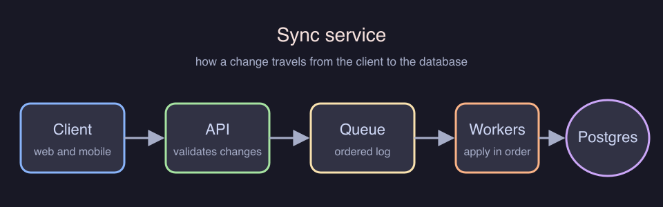

# Sync service architecture

How a change travels from the client to the database.

Clients push changes to the API, which validates them and writes to a queue.
Workers drain the queue and apply the changes to Postgres in order.

## Open questions

- [ ] Decide how long the queue keeps undelivered changes
- [ ] Add a dead-letter queue for poisoned messages

Tags: #engineering

Related: [[projects/mobile-app]] and [[welcome]].
