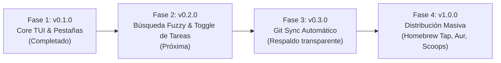

# 🗺️ Plan de Desarrollo Estratégico — Lazymark TUI

> **Proyecto:** `lazymark`  
> **Autor/Arquitecto:** Mathias Drizzy  
> **Objetivo:** TUI definitiva de alto rendimiento para Markdown, tareas y previsualización gráfica de imágenes, inspirada al 100% en lazygit.

---

## 1. Visión y Posicionamiento

Lazymark llena el vacío existente en el ecosistema terminal entre:
1. Editores complejos en modo texto (Neovim/Helix) que no ofrecen previsualización gráfica nativa ni gestión agregada de tareas.
2. Aplicaciones GUI pesadas basadas en Electron (Obsidian/Notion) que consumen cientos de megabytes de RAM y no se integran de forma natural con flujos CLI.

### Pilares Fundamentales
- **Rendimiento Cero Latencia:** Binario nativo estático en Go sin dependencias pesadas de runtime.
- **Ergonomía Lazygit + Vim:** Navegación por flechas o hjkl, pestañas indexadas [1..4], atajos mnemotécnicos de una tecla (`c`, `d`, `p`, `f`, `t`).
- **Gráficos en Terminal de Primera Clase:** Soporte nativo de Kitty Graphics Protocol para Ghostty, Kitty y WezTerm, con degradación elegante en terminales tradicionales.
- **Portabilidad Universal:** Empaquetado multiplataforma para macOS, Linux (X11/Wayland) y Windows.

---

## 2. Estado Actual de la Implementación (v0.1.0)

| Módulo / Pestaña | Estado | Características Implementadas |
|---|---|---|
| **[1] Notas** | ✅ 100% | Navegación, orden cronológico, render Glamour, suspensión para editor externo (`micro`/`$EDITOR`), pegado de imágenes (`p`), borrado (`d`), creación (`c`). |
| **[2] Categorías/Tags** | ✅ 100% | Extracción automática de `#tags`, conteo por tag, navegación por lista y previsualización de notas asociadas. |
| **[3] Tareas** | ✅ 100% | Agregación de checkboxes `- [ ]` / `- [x]`, filtro interactivo cíclico con `f` (Todas / Pendientes / Completadas), panel de detalle y salto a nota origen. |
| **[4] Galería de Imágenes** | ✅ 100% | Detección de adjuntos, renderizado Kitty Graphics Protocol nativo, fallback ASCII con metadatos. |
| **Mouse Engine** | ✅ 100% | `HitTester` geométrico interno; selección de notas, tags, tareas, imágenes, cambio de pestañas y botones del footer por clic. |
| **Temas Dinámicos** | ✅ 100% | 7 paletas intercambiables en caliente (`t` / `--theme`): 4 sabores Catppuccin, Tokyo Night, Gruvbox Dark, Nord. |
| **Compatibilidad Vim** | ✅ 100% | `j`/`k` (arriba/abajo), `h`/`l` (paneles), `g`/`G` (inicio/fin), `Esc` (salir). |
| **Multiplataforma** | ✅ 100% | Detección de portapapeles en macOS (`pngpaste`/`osascript`), Linux (`wl-paste`/`xclip`), Windows (PowerShell nativo). Rutas normalizadas. |

---

## 3. Roadmap de Desarrollo (Fases Futuras)

### Fase 2: v0.2.0 — Productividad y Búsqueda Fuzzy (Próxima Iteración)
- **Búsqueda Global Fuzzy (`/`):**
  - Integrar input interactivo con filtro instantáneo en tiempo real (título, contenido, tags).
- **Toggle Directo de Tareas (`Space`):**
  - Permitir alternar el estado `- [ ]` ↔ `- [x]` directamente desde la pestaña [3] Tareas pulsando la barra espaciadora, reescribiendo la línea correspondiente en el archivo Markdown sin necesidad de abrir el editor.
- **Scroll Suave en Panel de Vista Previa:**
  - Soporte de scroll vertical en el panel derecho con `PageUp`/`PageDown` o rueda del ratón.

### Fase 3: v0.3.0 — Sincronización y Respaldo Git
- **Auto-commit & Push Silencioso:**
  - Opción `--sync` para sincronizar automáticamente el directorio de notas con un repositorio Git remoto (GitHub, GitLab, Gitea) tras cada edición.
- **Detección de Cambios en Vivo:**
  - File watcher (`fsnotify`) para recargar notas en segundo plano si son editadas fuera de la TUI.

### Fase 4: v1.0.0 — Ecosistema y Plugins
- **Exportación:** Exportar notas a HTML/PDF vía renderizadores locales.
- **Fórmulas de Paquetes Oficiales:**
  - Publicación en Homebrew Core (`brew install lazymark`).
  - Publicación en Arch AUR (`paru -S lazymark-bin`).
  - Publicación en Windows Scoop (`scoop install lazymark`) y Winget.

---

## 4. Estrategia de Calidad y Blindaje

1. **Pre-commit Hook Obligatorio:** Ningún cambio puede commitearse sin que `python3 harness/validate_project.py` reporte `6/6 PASS`.
2. **Matrix CI en GitHub Actions:** Pruebas automatizadas en `macos-latest`, `ubuntu-latest` y `windows-latest`.
3. **Cero Secuencias OSC Tóxicas:** Aislamiento total de secuencias ANSI no estandarizadas que puedan colgar terminales o multiplexers (`herdr`, `tmux`, `zellij`).
4. **Higiene de Repositorio Público:** Archivos de orquestación de agentes locales (`.agents/`, `AGENTS.md`, `LEARNING_SYSTEM.md`) permanecen aislados en disco local mediante `.gitignore`.
