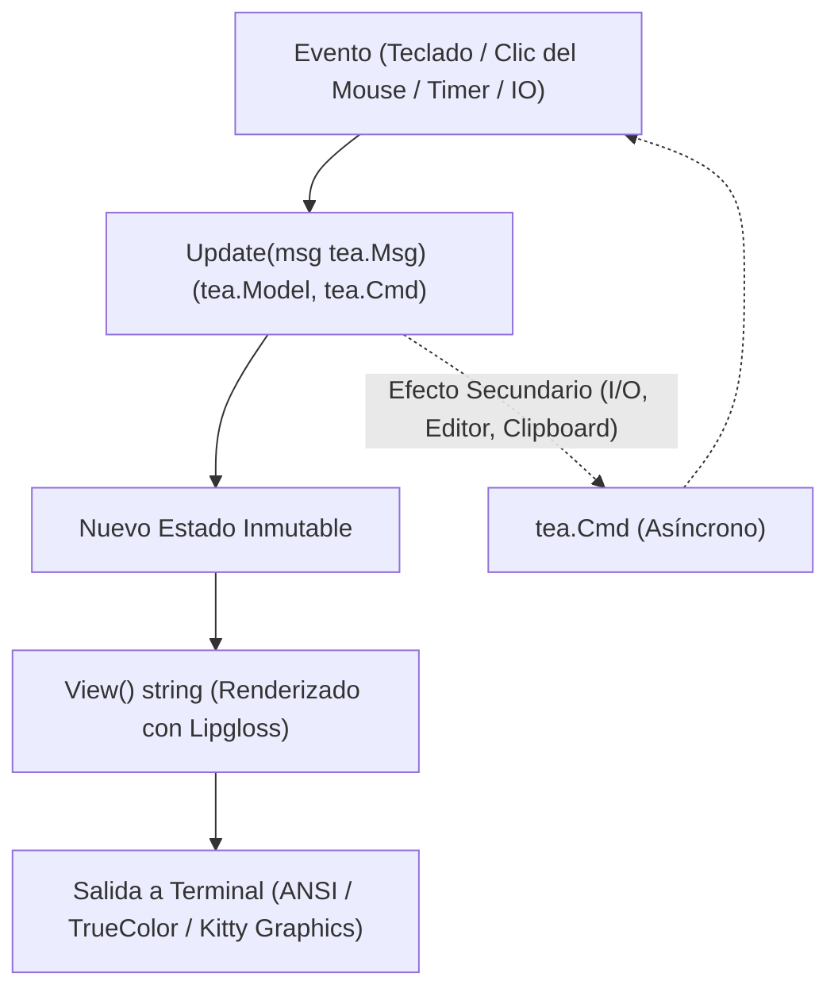

# 🔬 TUI Architecture Research: Diseño e Implementación de TUIs Modernas en Go

> **Proyecto:** `lazymark` (TUI para Markdown, Tareas e Imágenes estilo Lazygit)  
> **Arquitectura:** Lazymark Core Architecture  
> **Target:** Multiplataforma (macOS, Linux, Windows) en terminales modernas (Ghostty, WezTerm, Kitty).  

---

## 1. Patrón Arquitectónico: The Elm Architecture (TEA) en Go

La arquitectura de `lazymark` se fundamenta en **The Elm Architecture** provista por `bubbletea`. Este patrón garantiza flujo unidireccional de datos y elimina estados mutables concurrentes descontrolados.



### Principios de Modularidad por Sub-Modelos
En lugar de un modelo monolítico gigante, la interfaz se divide en componentes independientes:
- **`TabHeader`**: Maneja las 4 pestañas superiores y sus zonas de clic.
- **`NoteList`**: Maneja la lista de archivos, scroll, selección con teclado/flechas y clic del ratón.
- **`Preview`**: Maneja el renderizado Markdown (Glamour) y la llamada al protocolo Kitty para imágenes.
- **`Footer`**: Barra inferior de atajos y botones accionables por clic.
- Cada componente implementa su propio `Update(msg)` y `View()`, y el modelo raíz (`AppModel`) orquesta la navegación.

---

## 2. Soporte Integral de Mouse y Clicks en Bubble Tea

Bubble Tea soporta interacción de ratón mediante `tea.WithMouseCellMotion()`.

### Anatomía del Manejo de Mouse (`tea.MouseMsg`):
```go
case tea.MouseMsg:
    switch msg.Action {
    case tea.MouseActionPress:
        if msg.Button == tea.MouseButtonLeft {
            // Evaluar Hit-Test contra zonas registradas
            if zone, ok := m.hitTester.Check(msg.X, msg.Y); ok {
                return m.handleZoneClick(zone)
            }
        }
    case tea.MouseActionMotion:
        // Scroll con rueda del ratón
        if msg.Button == tea.MouseButtonWheelUp {
            m.preview.ScrollUp(3)
        } else if msg.Button == tea.MouseButtonWheelDown {
            m.preview.ScrollDown(3)
        }
    }
```

### Sistema de Hit-Testing (Bounding Boxes)
Para evitar dependencias frágiles, implementamos un **Hit-Tester geométrico**:
- Cada vista reporta sus rectángulos de renderizado: `(X1, Y1, X2, Y2)`.
- **Pestañas:** Clic en `[1] Notas` activa la pestaña 1.
- **Lista:** Clic en la fila `N` selecciona la nota `N`. Doble clic abre el editor externo.
- **Footer:** Clic en `[c] Nueva` dispara el diálogo modal.

---

## 3. Protocolo Gráfico Kitty (Kitty Graphics Protocol)

Ghostty, Kitty y WezTerm soportan nativamente el protocolo de gráficos de Kitty tanto en macOS como en Linux y Windows.

### Formato de Escapes Kitty:
La sintaxis estándar es:
`\x1b_G<parámetros>;<payload>\x1b\\`

1. **Transmisión de Archivo Directo (`t=f`):**
   Si la imagen está en el disco local (`.png`, `.jpg`), se puede enviar la ruta en base64:
   - `a=T`: Transmitir y mostrar de inmediato.
   - `f=100`: Formato autodetectado.
   - `t=f`: El payload es la ruta al archivo codificada en Base64.
   - `c=COLS,r=ROWS`: Escalar a la cantidad de columnas y filas del panel de preview.
2. **Limpieza y Garbage Collection Gráfico (`a=d`):**
   Al cambiar de una nota con imagen a otra de texto, es imperativo emitir el código de borrado (`\x1b_Ga=d\x1b\\`) para evitar imágenes fantasma superpuestas en el texto.

---

## 4. Integración del Editor Externo (`micro` / `$EDITOR`) sin Parpadeo

Para abrir un editor interactivo a pantalla completa sin romper la TUI:
```go
func openEditor(filePath string) tea.Cmd {
    editor := os.Getenv("EDITOR")
    if editor == "" {
        editor = "micro" // Editor predeterminado en dotfiles
    }
    c := exec.Command(editor, filePath)
    return tea.ExecProcess(c, func(err error) tea.Msg {
        return EditorFinishedMsg{Err: err}
    })
}
```
`tea.ExecProcess` se encarga de:
1. Liberar el modo raw de la terminal y restaurar el cursor.
2. Ceder el control al binario de `micro`.
3. Al cerrar `micro`, reanuda la TUI, reactiva el ratón y emite un mensaje para recargar la nota modificada.

---

## 5. Portabilidad Multiplataforma (macOS, Linux, Windows)

| Desafío | Solución Multiplataforma |
|---|---|
| **Ruta de Notas** | `filepath.Join(os.UserHomeDir(), "Documents", "notes")` con bandera de sobrescritura `--dir`. |
| **Separadores de Ruta** | Uso estricto de `filepath.Separator` y `filepath.Clean()`. |
| **Pegado de Imágenes del Portapapeles** | Enfoque dual: comandos nativos (`osascript/pngpaste` en macOS, `wl-paste/xclip` en Linux, `PowerShell` en Windows) con fallback a librería Go de portapapeles. |
| **Terminal Kitty Graphics** | Verificación de variables de entorno `$TERM`, `$TERM_PROGRAM` (ghostty, kitty, wezterm). En terminales sin soporte Kitty, se muestra un fallback estilizado con metadatos de la imagen. |
